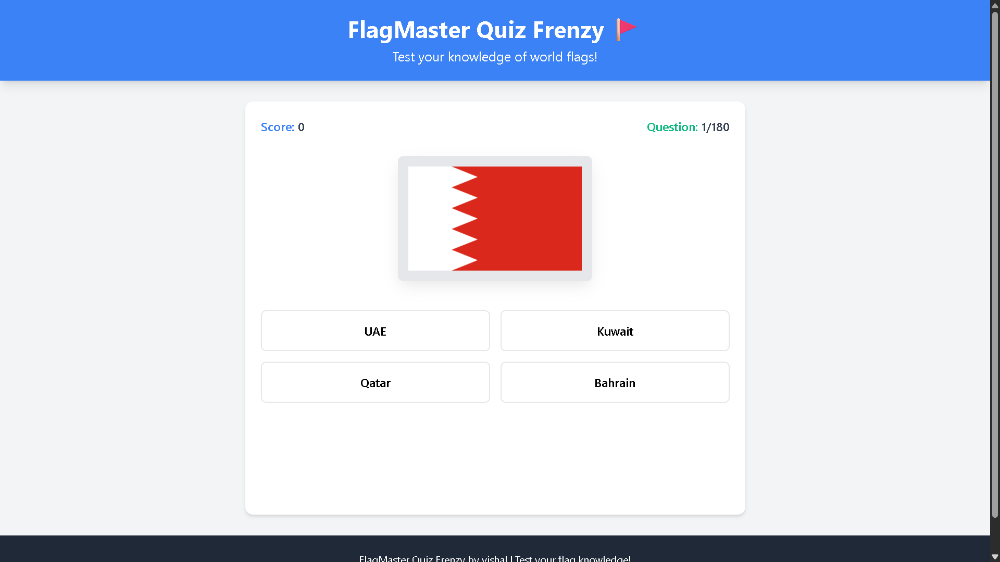
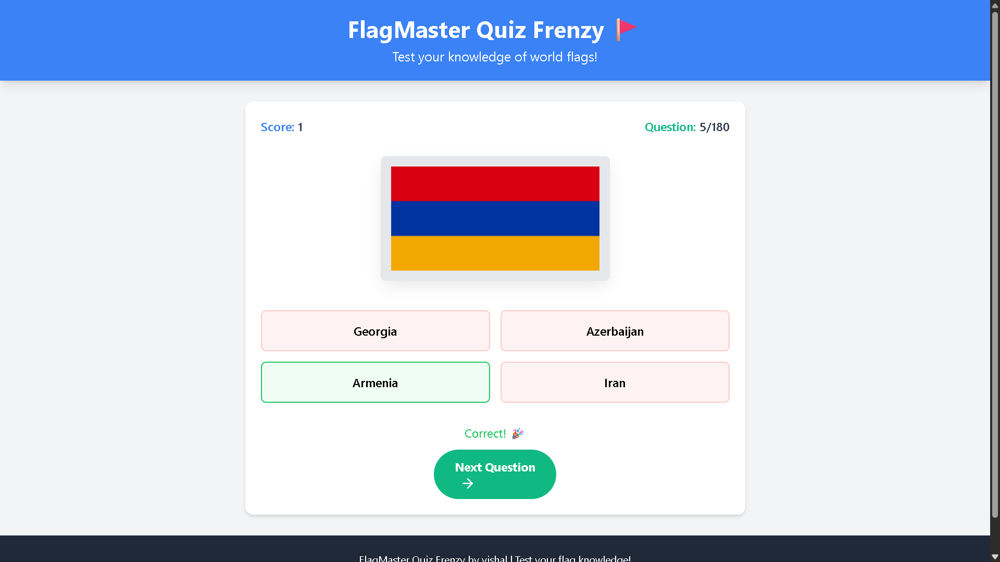
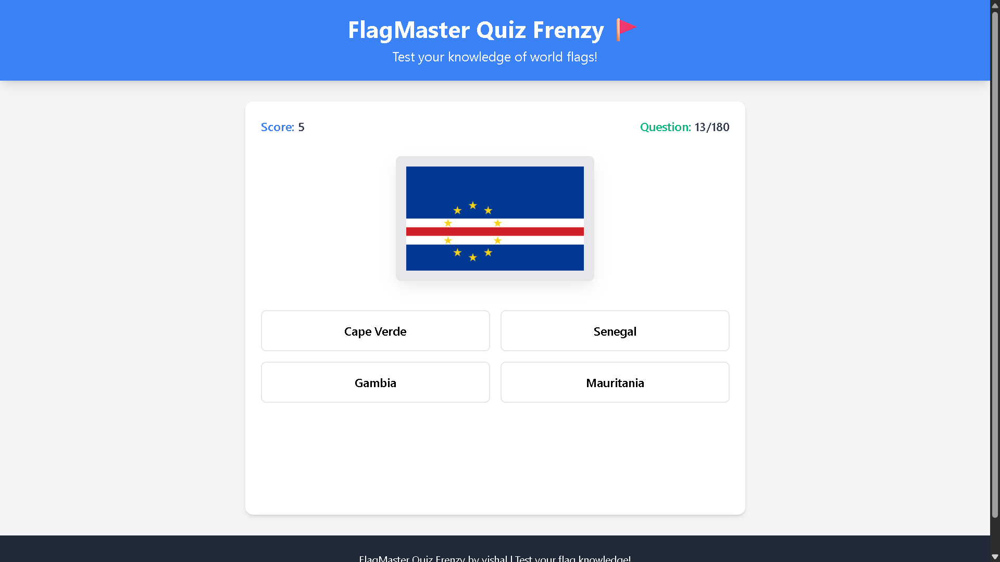
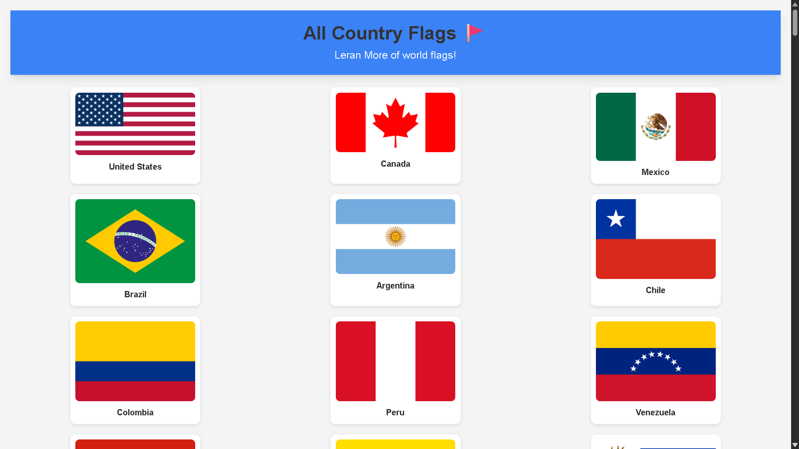

# 🌍 Flag Master – World Flags Quiz

**Flag Master** is an interactive web-based quiz game that helps users learn and test their knowledge of world flags.  
It includes **195 country flags** from around the world with multiple-choice answers, score tracking, and a full gallery view.



---

## 🚀 Features

- 🏳️‍🌈 Displays flags of all **195 recognized countries**
- 🧠 Interactive quiz mode with randomized questions and answers
- 🧾 Score tracking and performance summary
- 🔁 Play Again feature at the end of the quiz
- 🖼️ “All Flags Gallery” page displaying all flags with names in a **3-column responsive grid**
- 🌙 Modern UI built with **Tailwind CSS**
- 📦 Clean and modular JavaScript design

### 🖼️ Screenshots

| Quiz Screen | Score Screen | Gallery View |
|--------------|--------------|--------------|
|  |  |  |

---

## ⚙️ Tech Stack

| Component | Technology Used |
|------------|------------------|
| Frontend | HTML5, CSS3, TailwindCSS |
| Interactivity | Vanilla JavaScript (ES6) |
| Data | JSON-like array from `flag_master_flags_cleaned.js` |
| Icons | Feather Icons |
| Hosting (optional) | GitHub Pages / Localhost |

---

## 🧩 File Structure

```
Flag-Master/
├── flag_master.html               # Main quiz page
├── flag_master_flags_cleaned.js   # Contains all 195 flag data entries
├── flag_master_display.html       # Displays all flags in a grid view
├── flag_master_display.css        # custom CSS
├── flag_master_display.js         # JS file displays all flags in a grid view
├── README.md                      # This file
├── screenshots/
│   ├── flag_master_preview.png
│   ├── quiz_screen.png
│   ├── score_screen.png
│   └── gallery_view.png
```

---

## 💻 Setup Instructions

1. **Download or clone** this repository:
   ```bash
   git clone https://github.com/vishal-git-dot/flag-master.git
   ```

2. Open the project folder:
   ```bash
   cd flag-master
   ```

3. Simply open `flag_master.html` in your **web browser** (no server required).

4. To view all flags in gallery format, open `flag_master_display.html`.

---

## 🕹️ How to Play

1. Launch `flag_master.html`
2. A random flag will appear with 4 options.
3. Click on the correct country name.
4. Your score updates automatically.
5. Continue until all questions are answered.
6. View your final score and **Play Again** if desired.

---

## 🌐 Flag Sources

- Flags provided by [flagcdn.com](https://flagcdn.com)  
- Supplementary flags (like **Kosovo**) from [Wikimedia Commons](https://commons.wikimedia.org/)

---

## 🧑‍💻 Developer Notes

- Each flag entry in `flag_master_flags_cleaned.js` follows this structure:
  ```js
  { 
    flag: "https://flagcdn.com/w320/in.png", 
    country: "India", 
    options: ["Pakistan", "India", "Bangladesh", "Sri Lanka"]
  }
  ```

- Total entries: **195 unique countries**
- Fully responsive layout using Tailwind’s grid utilities

---

## 🏁 License

This project is for educational and personal use.  
© 2025 Flag Master | Created by Vishal
